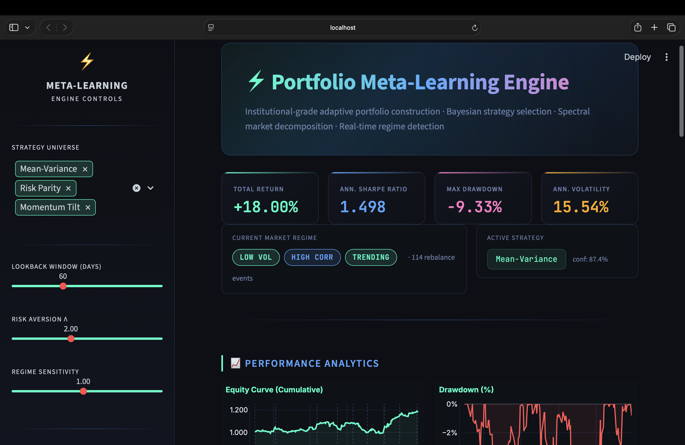
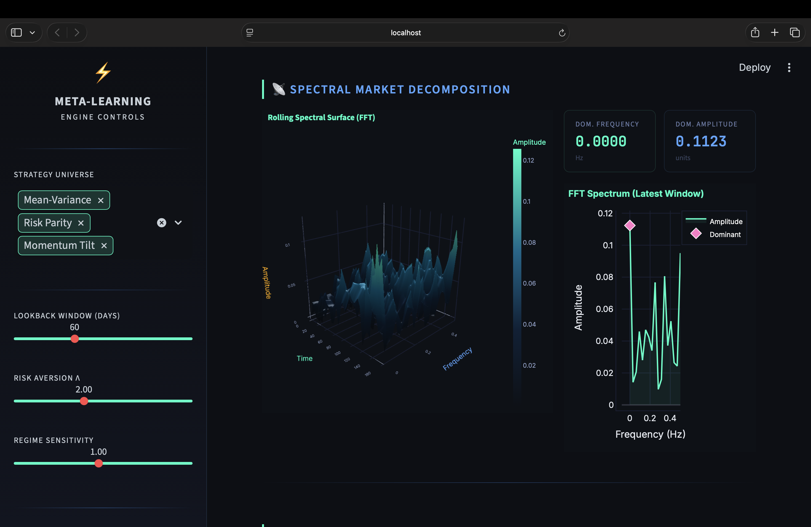

<div align="center">

# ⚡ Portfolio Meta-Learning Engine

**Institutional-grade adaptive portfolio construction powered by Bayesian meta-learning, spectral market decomposition & real-time regime detection.**

[](https://python.org)
[](https://streamlit.io)
[](https://plotly.com)
[](LICENSE)
[](https://github.com/alwaysprince05)

</div>

---

## 📸 Live Dashboard Preview



> *Real-time dashboard showing +18.00% total return · Sharpe 1.498 · Max Drawdown -9.33% · Ann. Volatility 15.54%*



> *Spectral Market Decomposition — Interactive 3D rolling FFT surface (Time × Frequency × Amplitude) with dominant frequency at 0.0000 Hz · amplitude 0.1123 units*

---

## 🧠 What Is This?

The **Portfolio Meta-Learning Engine** is a quant-grade interactive dashboard that dynamically selects the optimal portfolio strategy based on the current detected market regime. It combines:

- **Bayesian Meta-Learning** — scores and selects strategies (Mean-Variance, Risk Parity, Momentum Tilt, etc.) using per-window Sharpe ratios with confidence scoring
- **Gaussian Mixture Model (GMM) Regime Detection** — identifies volatility, correlation, and trend regimes in real time
- **FFT Spectral Decomposition** — decomposes market returns into dominant frequency components via rolling Fast Fourier Transform
- **Adaptive Rebalancing** — triggers rebalancing only on regime shifts, reducing unnecessary turnover

Built for **quant researchers**, **algo traders**, and **finance enthusiasts** who need more than a static allocation model.

---

## ✨ Dashboard Features

| Section | What You See |
|---|---|
| 🎛️ **Sidebar Controls** | Strategy Universe, Lookback Window, Risk Aversion λ, Regime Sensitivity sliders |
| 📊 **KPI Cards** | Total Return · Ann. Sharpe Ratio · Max Drawdown · Ann. Volatility — live computed |
| 🌍 **Market Regime Bar** | `LOW VOL` / `HIGH VOL` · `HIGH CORR` / `LOW CORR` · `TRENDING` / `MEAN-REV` badges |
| 🎯 **Active Strategy** | Current best-performing strategy + confidence score (e.g. *Mean-Variance — 87.4%*) |
| 📈 **Equity Curve** | Cumulative portfolio value with rebalance event markers |
| 📉 **Drawdown Chart** | Rolling drawdown from peak, filled red |
| 📐 **Rolling Sharpe** | 20-day rolling Sharpe ratio with threshold line |
| 🔵 **Strategy Confidence** | Scatter of which strategy was active and with what confidence |
| ⚖️ **Allocation Evolution** | Stacked area chart of SPY · TLT · GLD weights over time |
| 📡 **3D Spectral Surface** | Interactive FFT rolling surface — time × frequency × amplitude |
| 🔬 **3D Portfolio Allocation** | 3D scatter showing asset weight shifts across the last 40 days |
| 🗺️ **Regime Heatmap** | Colour-coded market regime states over the last 60 days |

---

## 🚀 Strategies Supported

| Strategy | Description |
|---|---|
| **Mean-Variance** | Classic Markowitz optimisation with tunable risk aversion λ |
| **Risk Parity** | Equal risk contribution across all assets |
| **Minimum Variance** | Lowest portfolio volatility allocation |
| **Momentum Tilt** | Weights assets by Sharpe-adjusted trailing momentum |
| **Defensive Allocation** | Inverse-volatility weighting for capital preservation |

---

## ⚙️ How It Works

```
Market Data  ──►  yfinance  (SPY · TLT · GLD)
        │
        ▼
Feature Computation
  └─ Log-returns · Rolling Volatility · Correlation · Trend Strength
        │
        ▼
Regime Detection
  └─ GMM (volatility) + PCA (correlation) + Trend threshold → 3-axis regime label
        │
        ▼
Bayesian Strategy Selection
  └─ Per-window Sharpe scoring → best strategy + Gaussian confidence score
        │
        ▼
Adaptive Rebalancing
  └─ Triggers only on regime or strategy change → lower turnover
        │
        ▼
Performance Engine
  └─ Equity curve · Drawdown · Rolling Sharpe · Port returns
        │
        ▼
Spectral Analysis  (FFT rolling surface)
        │
        ▼
⚡ Streamlit Interactive Dashboard (Plotly charts)
```

---

## 🛠️ Quick Start

### 1. Clone
```bash
git clone https://github.com/alwaysprince05/Portfolio-Meta-Learning-Engine.git
cd Portfolio-Meta-Learning-Engine
```

### 2. Install dependencies
```bash
pip install streamlit pandas numpy plotly yfinance scipy scikit-learn
```

### 3. Launch
```bash
streamlit run portfolio_meta_learning_engine.py
```

### 4. Open browser
```
http://localhost:8501
```

---

## 🎛️ Sidebar Controls

| Parameter | Range | Default | Description |
|---|---|---|---|
| **Strategy Universe** | Multiselect | MV · RP · MT | Strategies included in the meta-learner pool |
| **Lookback Window** | 30 – 120 days | 60 | Rolling window for all feature computation |
| **Risk Aversion λ** | 0.1 – 5.0 | 2.0 | Controls risk/return trade-off in Mean-Variance |
| **Regime Sensitivity** | 0.1 – 2.0 | 1.0 | Threshold sensitivity for trend regime detection |

---

## 📁 Project Structure

```
Portfolio-Meta-Learning-Engine/
│
├── portfolio_meta_learning_engine.py   # Core engine — all logic & visualisations
├── dashboard.png                       # Dashboard screenshot
├── README.md                           # Project documentation
└── LICENSE                             # MIT License (© 2026 Prince Maurya)
```

---

## 📦 Requirements

```
Python 3.8+
streamlit
pandas
numpy
plotly
yfinance
scipy
scikit-learn
```

---

## 📄 License

This project is licensed under the **MIT License** — see the [LICENSE](LICENSE) file for details.

Copyright © 2026 **Prince Maurya**

---

<div align="center">

⚡ Built by **[Prince Maurya](https://github.com/alwaysprince05)** · [github.com/alwaysprince05](https://github.com/alwaysprince05)

*If this project helped you, consider giving it a ⭐*

</div>
